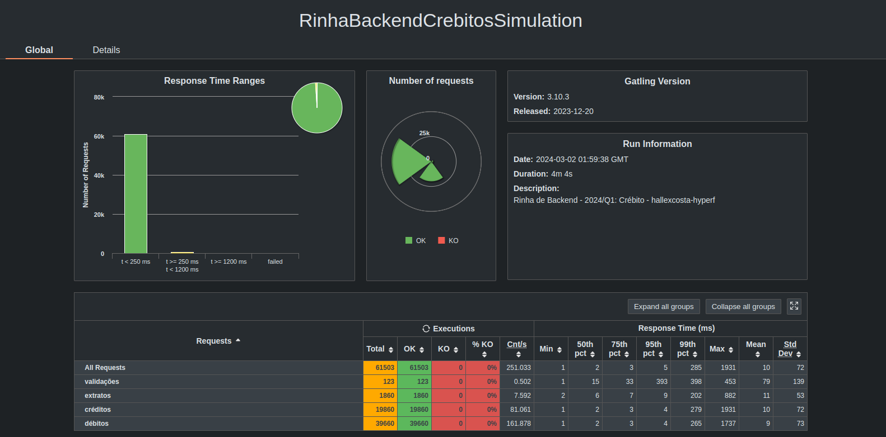
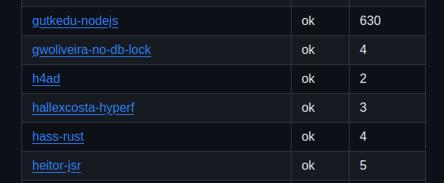
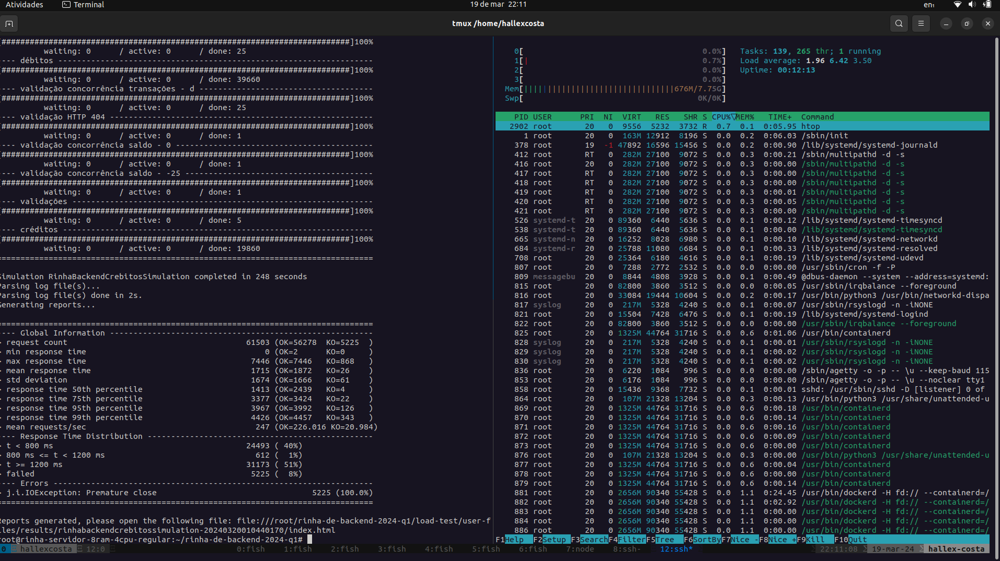
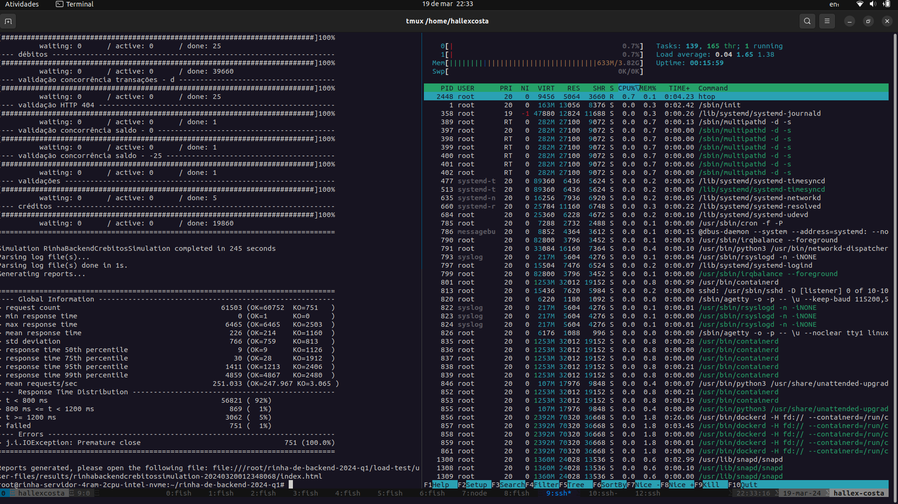
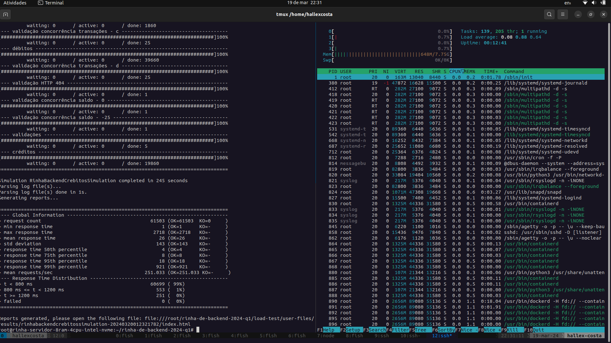

# Métricas

### Executando os testes

Script utilizado para rodar os testes nas maquinas

```sh
apt install unzip -y \

git clone https://github.com/HallexCosta/rinha-de-backend-2024-q1.git \

wget https://repo1.maven.org/maven2/io/gatling/highcharts/gatling-charts-highcharts-bundle/3.10.4/gatling-charts-highcharts-bundle-3.10.4-bundle.zip \

unzip gatling-charts-highcharts-bundle-3.10.4-bundle.zip \

mv gatling-charts-highcharts-bundle-3.10.4 gatling \

sudo apt install default-jre -y \

cd rinha-de-backend-2024-q1/participantes/hallexcosta-hyperf \

sudo docker compose up -d \

cd ../../ \

sudo ./executar-teste-local.sh
```

### Resultados




## Dimensões de Maquinas

### Regular
> Rinha Servidor 4 RAM/2CPUs Regular SSD


> Rinha Servidor 8 RAM/4CPUs Regular SSD



### Premium
> Rinha Servidor 4 RAM/2CPUs Intel NVMe



> Rinha Servidor 8 RAM/2CPUs Intel NVMe


> Rinha Servidor 8 RAM/4CPUs Intel NVMe


